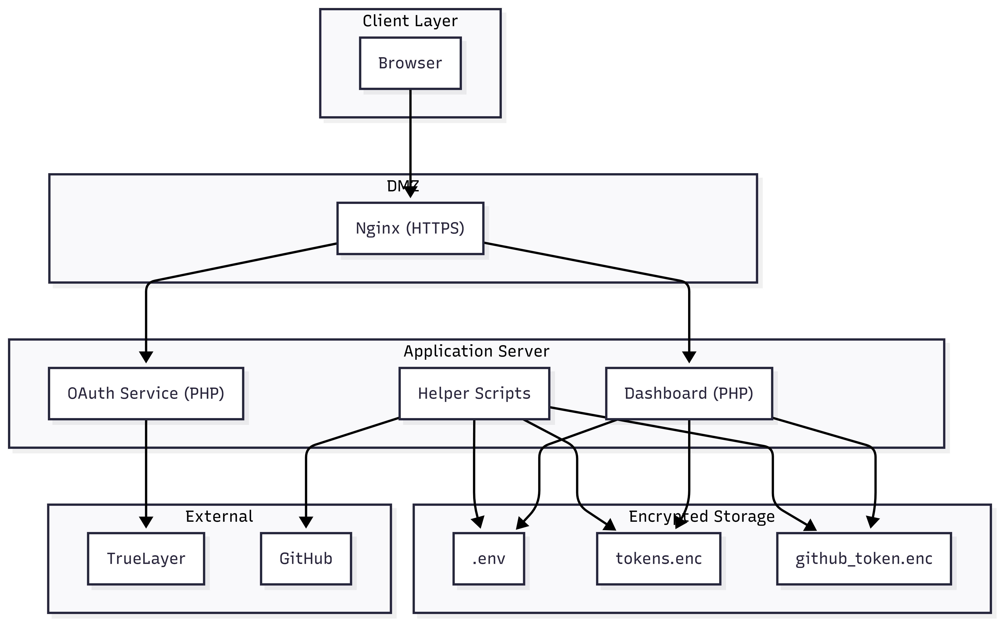
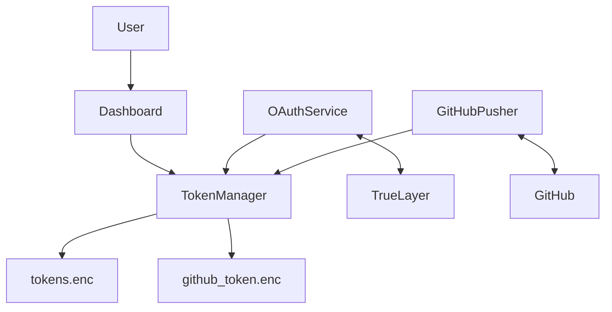

# asktown-pf - System Design Document

## 1. Overview

`asktown-pf` is a personal finance monitoring system that securely connects to UK banks via TrueLayer Open Banking and provides a web dashboard for monitoring balances, services, and server performance.

## 2. High-Level Architecture

## 3. Data Flow Diagram

## 4. Storage Architecture

| File                          | Purpose                    | Encryption   | Permissions |
|------------------------------|----------------------------|--------------|-------------|
| `/opt/finance/.env`          | Encryption key             | None         | 640         |
| `/opt/finance/tokens.enc`    | TrueLayer tokens           | libsodium    | 640         |
| `/opt/finance/github_token.enc` | GitHub Personal Access Token | libsodium | 660         |

## 5. Security Controls

- Dedicated low-privilege user (`truelayer`)
- All secrets stored outside the Git repository
- Strict file permissions (`600`/`640`/`750`)
- Rate limiting on dashboard login (5 attempts)
- No secrets committed to GitHub

## 6. Key Processes

1. **Bank Authorization** — User authorizes via TrueLayer → tokens are encrypted and stored
2. **Dashboard Monitoring** — Reads encrypted tokens to display connected banks and live metrics
3. **GitHub Integration** — Securely stores and retrieves GitHub token for automated deployments
4. **Token Refresh** — Uses stored refresh token to obtain new access tokens when needed

## 7. Technology Stack

- **Web Server**: Nginx (SSL termination)
- **Application**: PHP 8.3
- **Encryption**: libsodium (`sodium_crypto_secretbox`)
- **Monitoring**: Chart.js (live updating graphs)
- **Version Control**: Git + automated push script

## 8. Deployment

- **Server**: Hostinger VPS
- **Users**: `root`, `www-data`, `truelayer`
- **Network**: Hostinger firewall + ufw
